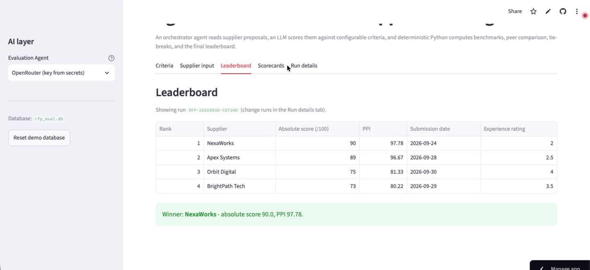
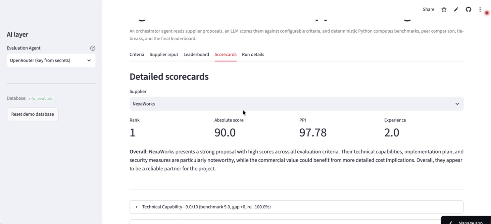
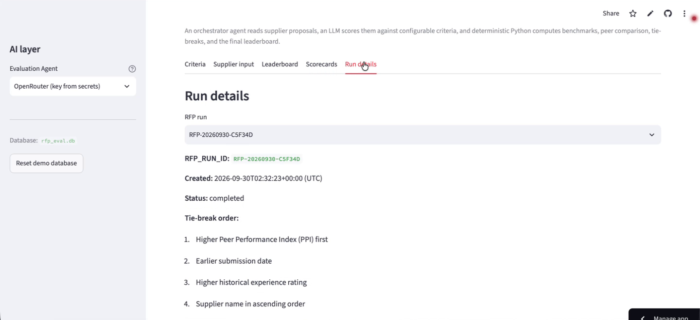
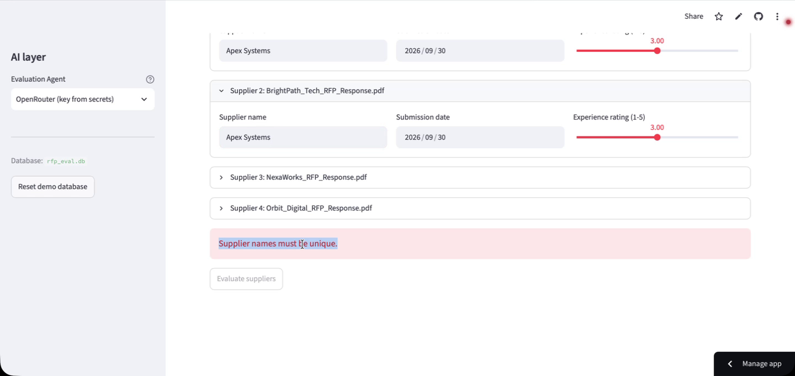

# Agentic RFP Evaluation & Supplier Ranking

An agentic workflow that reads supplier RFP proposals (PDF), scores them with an
LLM evaluation agent against configurable criteria, validates and normalizes the
scorecards, then deterministically computes weighted scores, peer benchmarks,
a Peer Performance Index (PPI), tie-breaks, and a final leaderboard — persisted
in SQLite and downloadable as one complete JSON.

**Live app:** https://rfp-eval-qsspy7fqn479mpep8cqsau.streamlit.app  
**Source:** https://github.com/sridutt07/rfp-eval

## Quick start

```bash
python -m venv .venv && source .venv/bin/activate   # or: python -m venv .venv; .venv\Scripts\activate
pip install -r requirements.txt

# 1. Create and seed the database
python scripts/init_db.py

# 2. Generate the 4 fictional supplier PDFs (2-4 pages each)
python scripts/make_sample_pdfs.py

# 3. Run the full demo (success case + validation/error handling)
python scripts/demo.py

# 4. Run the tests
pytest

# 5. Launch the Streamlit UI
streamlit run app.py
```

No API key is needed: the built-in **mock evaluation agent** scores proposals
deterministically. To use a real model, choose one of these in the app sidebar:

- **OpenRouter (key from secrets)** — reads `OPENROUTER_API_KEY` (and optional `OPENROUTER_MODEL`, default `openai/gpt-4o-mini`) from `.streamlit/secrets.toml` locally, Streamlit Cloud *Secrets*, or the environment.
- **OpenAI-compatible API** — enter model / base URL / API key manually (OpenAI, Ollama, vLLM, ...).

## Architecture & data flow

```
PDF uploads ──► Document Tool (pdf_tools: PyMuPDF text extraction)
                    │
                    ▼
            Orchestrator (pipeline.run_evaluation)
                    │
        ┌───────────┴───────────┐
        ▼                       ▼
 Evaluation Agent (llm.py)   criteria + weights pulled LIVE from SQLite
   • MockLLMClient           (prompts.py builds the model prompt from the DB,
     (deterministic, no key)  so criteria can change without code edits)
   • OpenAICompatibleClient
     (OpenRouter / OpenAI / any JSON-capable model)
        │
        ▼
 Validation Tool (validation.py)
   • missing criteria → imputed as 0
   • invalid numbers → coerced or 0
   • out-of-range → clipped to [0, max_score]
   • unknown/duplicate criterion ids handled, warnings recorded
        │
        ▼
 Deterministic computation (NO LLM involved):
   scoring.py  absolute weighted score, per-criterion benchmark (peer best),
               gap (score − benchmark), relative performance %
   ranking.py  PPI + mandatory tie-break order + sequential ranks 1..n
        │
        ▼
 SQLite (db.py) — all supplier results stored under ONE rfp_run_id
        │
        ▼
 JSON export (export.py) — complete run payload, downloadable from the UI
```

## SQLite schema

- `evaluation_criteria` — `criterion_id, name, description, weight, max_score, is_active`
- `rfp_runs` — `rfp_run_id, created_at, status`
- `supplier_results` — `rfp_run_id, supplier_name, submission_date, experience_rating, absolute_score, ppi, final_rank, result_json`

Seed data (5 criteria, weights total 100%):

| # | Criterion | Weight | Max |
|---|-----------|--------|-----|
| 1 | Technical Capability | 30% | 10 |
| 2 | Implementation Plan | 20% | 10 |
| 3 | Commercial Value | 20% | 10 |
| 4 | Security & Compliance | 20% | 10 |
| 5 | Support & Experience | 10% | 10 |

## Formulas (deterministic — never delegated to the LLM)

- **Absolute score** = Σ (score_c / max_score_c × weight_c), i.e. a 0–100 weighted total
- **Benchmark** per criterion = max peer score (0 if every peer scored 0)
- **Gap** = score − benchmark (≤ 0)
- **Relative %** = score / benchmark × 100, or 100% if benchmark = 0 (safe zero handling)
- **PPI** = Σ (relative%_c × weight_c) / 100 — measures how close a supplier is to the peer best across all criteria
- **Ranking** = stable sort by the mandatory tie-break order, then ranks 1, 2, 3, … assigned sequentially:
  1. Higher PPI first
  2. Earlier submission date
  3. Higher historical experience rating
  4. Supplier name ascending

## Validation policy

| Situation | Handling |
|---|---|
| Missing criterion | imputed 0, warning recorded |
| Non-numeric score | coerced if parseable (e.g. `"8"` → 8.0), else 0 |
| Score outside [0, max_score] | clipped, warning recorded |
| `max_score` ≠ database value | database wins |
| Duplicate criterion_id | first occurrence kept |
| Unknown criterion_id | ignored, warning recorded |
| Missing evidence/justification/summary, malformed risks | defaults + warnings |
| Broken structure (no criteria list, not a dict) | `ValidationError` — supplier skipped |

## The four fictional suppliers

| Supplier | Profile | Price |
|---|---|---|
| Apex Systems | Enterprise platform, certified security, senior staff — premium | $485,000 / 9 mo |
| BrightPath Tech | Young startup, lean fixed price, fastest timeline — weak compliance history | $319,000 / 6 mo |
| NexaWorks | Transit-focused mid-size vendor, balanced proposal, CAD/AVL specialists | $398,000 / 8 mo |
| Orbit Digital | 15 years transit experience, strongest references — vague integration plan | $442,000 / 10 mo |

Generated PDFs live in `data/sample_pdfs/`. A sample evaluated run is in
`sample_output/sample_run.json`.

## Demo

### Recorded demonstrations (deployed app, live LLM via OpenRouter)

| Video | What it shows |
|---|---|
| [`Success_verification.webm`](OUTPUT_INFO/Videos/Success_verification.webm) | **Successful run.** Four PDFs uploaded, agent set to *OpenRouter (key from secrets)*, each supplier evaluated by the LLM, then leaderboard, scorecard and run details. All suppliers use the same date and rating here. |
| [`Diffrent_dates_ratings.webm`](OUTPUT_INFO/Videos/Diffrent_dates_ratings.webm) | **Successful run with different submission dates and experience ratings** per supplier (24/28/29/30 Sep; ratings 2, 2.5, 3.5, 4). Ends on the leaderboard (`RFP_RUN_ID` `RFP-20260930-C5F34D`), scorecard and run details. |
| [`Dublicate_File_validation_error.webm`](OUTPUT_INFO/Videos/Dublicate_File_validation_error.webm) | **Validation / error case.** Two suppliers given the same name: the app shows "Supplier names must be unique." and keeps *Evaluate suppliers* disabled. |

In the different-dates run every supplier ends with a distinct PPI, so PPI alone decides the order and the date/rating tie-breaks are not triggered. Tie-break steps 2–4 are exercised by the unit tests (`tests/test_scoring.py`) and by the dates/ratings used in `scripts/demo.py`.

### Sample exported JSON

| File | Run |
|---|---|
| [`OUTPUT_INFO/Diffrent_Dates_ranking.json`](OUTPUT_INFO/Diffrent_Dates_ranking.json) | Live-LLM run `RFP-20260930-C5F34D` with different dates/ratings; matches `Diffrent_dates_ratings.webm` and the screenshots below. |
| [`OUTPUT_INFO/Inital_run.json`](OUTPUT_INFO/Inital_run.json) | First live-LLM run (`RFP-20260930-DE6C8A`), same date and rating for all suppliers. |
| [`sample_output/sample_run.json`](sample_output/sample_run.json) | Deterministic mock-agent run produced by `scripts/demo.py`. |

Each file is the complete run: criteria, tie-break order, warnings, and per supplier the absolute score, PPI, rank, and per-criterion score / benchmark / gap / relative % / weight / justification / evidence.

LLM scoring is not deterministic, so scores can differ between live runs; the formulas, tie-breaks and ordering applied to validated scorecards are deterministic.

### Scripted demo

`python scripts/demo.py` runs:

1. **Successful end-to-end run** — 4 suppliers → validated scorecards → benchmarks, PPI, ranked leaderboard → one `RFP_RUN_ID` persisted in SQLite → JSON export.
2. **Validation & error handling** — out-of-range clipping, numeric-string coercion, missing-criterion imputation, unknown/duplicate ids, `max_score` mismatch correction, malformed risks, and a structurally broken output that raises `ValidationError`.

## Deployment (Streamlit Community Cloud)

1. Push this folder to a public GitHub repo (`.venv`, `.env` and `.streamlit/secrets.toml` are git-ignored — never commit them).
2. Go to https://share.streamlit.io → *New app* → pick the repo, branch `main`, main file `app.py`. Under *Advanced settings* choose Python 3.11.
3. The app creates and seeds `data/rfp_eval.db` on first run. It works immediately with the built-in Mock agent.
4. To use a real model, open the app's *Settings → Secrets* and add:
   ```toml
   OPENROUTER_API_KEY = "your-key"
   OPENROUTER_MODEL = "openai/gpt-4o-mini"
   ```
   then choose **OpenRouter (key from secrets)** in the sidebar. Because the app URL is public, set a spend limit on the key.

## Screenshots

Captured from the deployed app during the live OpenRouter run `RFP-20260930-C5F34D` (different dates and ratings).

**Leaderboard** — rank, supplier, absolute score, PPI, submission date, experience rating



**Detailed scorecard** — per-criterion score, benchmark, gap, relative %, evidence and justification



**Run details** — `RFP_RUN_ID`, status, tie-break explanation, warnings, JSON download



**Validation case** — duplicate supplier name blocks evaluation



## Assumptions

- Scores are 0..max_score per criterion; active weights should total 100%.
- If a benchmark is 0, relative % is defined as 100 for everyone (all tied at zero).
- Submission dates are ISO `YYYY-MM-DD`; experience rating is a number (higher is better).
- All supplier PDFs are fictional and generated by `scripts/make_sample_pdfs.py` into `data/sample_pdfs/`.

## Project layout

```
app.py                  Streamlit UI (criteria, input, leaderboard, scorecards, run details)
rfp_eval/               agent/tool modules (document, evaluation, validation, scoring, ranking)
scripts/                init_db.py · make_sample_pdfs.py · demo.py
tests/                  pytest suite (scoring, tie-breaks, validation, DB, determinism)
data/                   rfp_eval.db (generated) · sample_pdfs/ (generated)
sample_output/          sample_run.json (mock-agent demo output)
OUTPUT_INFO/            live-LLM run JSON + demo videos
docs/                   README screenshots
```
